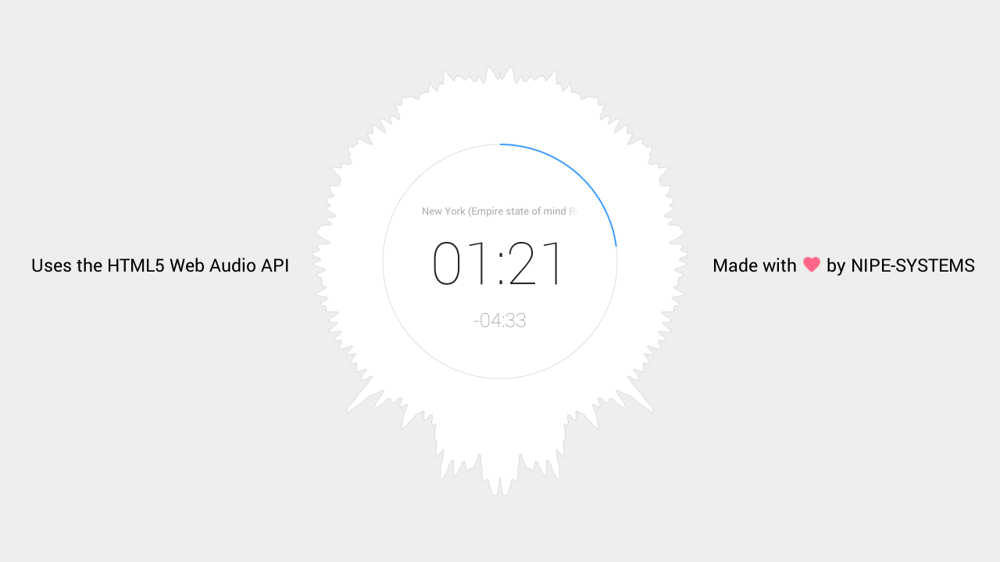

# HTML5 Web Audio API Showcase

## Demo of the showcase

... can be found at [http://nipe-systems.de/webapps/html5-web-audio](http://nipe-systems.de/webapps/html5-web-audio).

## How to use

1. Select an audio file
2. Press "Play song"
3. Modify the volume by scrolling on the circle canvas
4. Enjoy!

## Features

* no external libraries, pure Javascript
* audio visualization with the spectrum of the played sound
* volume by scrolling on the circle
* elapsed and remaining time of the playback
* filename displayed at the top of the circle (animates if it is too long)
* build with [Material Design](https://www.google.com/design/spec/material-design/introduction.html) (not for the circle because shadows are too resource-intense)

## Uses

* [Web Audio API](http://www.w3.org/TR/webaudio/)
* [HTML Canvas 2D Context](http://www.w3.org/TR/2dcontext/)
* [Scalable Vector Graphics (SVG 1.1)](http://www.w3.org/TR/SVG11/)
* CSS3 Animations, Transforms, Transisitions
* [Material Design](https://www.google.com/design/spec/material-design/introduction.html)

## License

lastest GPL-license (see LICENSE-file)

Copyright (C) 2015 NIPE-SYSTEMS, [http://nipe-systems.de](http://nipe-systems.de)
